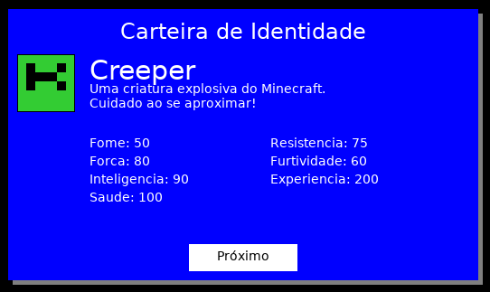

# README do Projeto Creeper 🌟

Este repositório contém um projeto prático desenvolvido no contexto do curso de Lua oferecido pela Digital Innovation One (DIO). O objetivo deste projeto é explorar e aplicar os conceitos fundamentais da linguagem Lua, criando um perfil de destaque que pode ser um excelente diferencial em entrevistas técnicas.
- Data de inicio: 06/11/2024
- Instrutor: Rafael Skoberg

## Descrição do Projeto

Bem-vindo ao repositório do projeto "Creeper", um programinha divertido em Lua que dá vida a um dos personagens mais icônicos do Minecraft! 🧙‍♂️💥 Aqui, exploramos os conceitos fundamentais da linguagem Lua enquanto nos divertimos criando um cartão de identidade para o Creeper.

Neste projeto, você encontrará:
- Uma apresentação do Creeper, incluindo sua descrição, som e atributos.
- Interatividade, permitindo que o usuário veja a história do Creeper e interaja com o programa.
- Um bom uso de boas práticas de programação, como modularização e clareza no código.

O objetivo? Mostrar minhas habilidades em programação e, quem sabe, conquistar meu lugar no coração dos recrutadores! 😎

## Estrutura do Repositório

O repositório contém:

- **Código-fonte**: O arquivo `desafio.lua`, que é a estrela do show!
- **Documentação**: Comentários que ajudam a entender o que está acontecendo.

## Mudanças e Novas Implementações

Vamos dar uma olhada nas mudanças divertidas que fizemos no código! 🎉

### 1. Limpeza da Tela

Antes, o programa mostrava tudo de uma vez, o que poderia ser um pouco confuso. Agora, adicionamos uma função para limpar a tela antes de mostrar novas informações:

```lua
-- Limpar a tela
local function clearScreen()
    os.execute("cls") -- Para Windows
    os.execute("clear") -- Para Unix/Linux
end
```

### 2. Uso de Tabelas para Atributos

No código original, os atributos eram armazenados em variáveis separadas. Mudamos para uma tabela, tornando tudo mais organizado e fácil de gerenciar:

```lua
-- Atributos
local attributes = {
    Ataque = 10,
    Defesa = 1,
    Vida = 5,
    Velocidade = 7,
    Inteligencia = 2 
}
```

### 3. Função de Impressão do Cartão

Criamos uma função `printCard()` que cuida de exibir todas as informações do Creeper de maneira organizada. Olha só como ficou:

```lua
-- Função para imprimir o cartão do monstro
local function printCard()
    clearScreen() 
    print(string.rep("=", 50))
    print("| " .. monsterName)
    print("| " .. description)
    ...
    print(string.rep("=", 50))
end
```

### 4. Interatividade Melhorada

Agora, o usuário pode decidir se quer ver a história do Creeper ou sair. Isso tornou o programa muito mais divertido e interativo! 🚀

```lua
-- Loop principal
while true do
    printCard()
    print("Deseja ver a história do personagem? (s/n)")
    local choice = io.read()
    if choice == "s" then 
        printStory()
    ...
end
```
### 4. Indo além

Durante os estudo tive curiosidade de como melhorar a apresentação, dei uma olhadinha rápida no Löve🚀


## Conclusão

E aí está! O projeto "Creeper" não é apenas uma forma de praticar Lua, mas também uma oportunidade de brilhar e mostrar suas habilidades em programação. 💪✨

Adicionamos algumas funcionalidades legais, melhoramos a estrutura do código e, o mais importante, tornamos a experiência do usuário muito mais agradável! Agora, com o código organizado e interativo, você pode impressionar qualquer recrutador que cruzar seu caminho.

Sinta-se à vontade para fazer um **fork** deste repositório, implementar melhorias ou criar novos projetos inspirados no nosso querido Creeper. Cada contribuição é uma chance de brilhar ainda mais! E quem sabe, você não se torna o próximo guru da programação? 🌟

Vamos lá, é hora de codar e se divertir! 🎉
